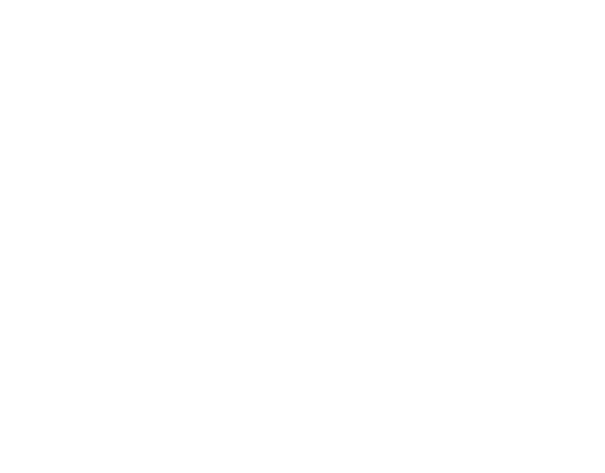
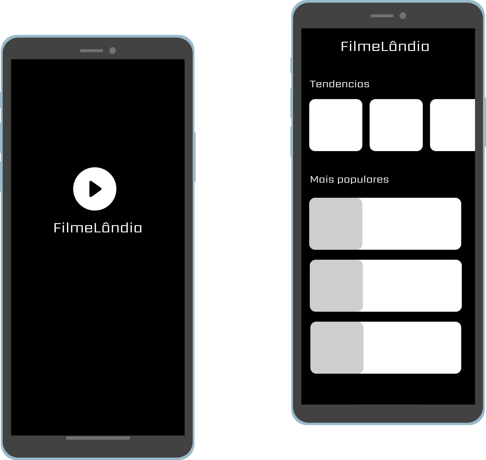

<h2 align="center">
    
</h2>

✅ A test project to display movie lists 

  <row>
    
    
    
    
  </row>

 

## 📱 Screenshot

  

 

## 🚀 Technologies

This project was developed with the following technologies and libraries:
- [React Native](https://reactnative.dev/)
- [Redux](https://redux.js.org/)
- [Axios](https://axios-http.com/docs/intro)
- [Styled-components](https://styled-components.com/)
- [Jest](https://jestjs.io/pt-BR/)

## 💻 About
This project aims to meet some requirements to test the level of knowledge of the mobile development stack mentioned above. The app displays a trend list of the most popular movies and movies provided by the api [Tract Api](https://trakt.docs.apiary.io/#reference/movies).

## 🤔 How to contribute?

- Fork the repository;
- 
- Create a branch named after your improvement/fix: `git checkout -b feature/your_feature_name`;
- Commit your changes: `git commit -m 'feat: My new feature'`;
- Push your branch: `git push origin feature/your_feature_name`.
- open a PR here 💙.

## 📝 License

This project has the MIT license. See the [LICENSE](LICENSE) for more details.

---

Create with 💙 by Judson Henrique
